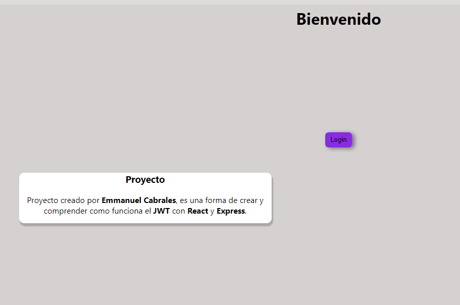

# Proyecto de Autenticación JWT

Este proyecto desarrollado por Emmanuel Cabrales Fuentes permite a los usuarios registrarse, iniciar sesión y experimentar con la autenticación mediante JSON Web Tokens (JWT).
## Capturas de Pantalla

## Tecnologías Utilizadas

- **Frontend:**
  - React
  - (Otras bibliotecas o frameworks utilizados en el frontend)

- **Backend:**
  - Node.js
  - Express
  - Sequelize (para la conexión con la base de datos)
  - PostgreSQL (o cualquier otra base de datos que estés utilizando)

## Requisitos Previos

Asegúrate de tener instalados los siguientes requisitos previos antes de ejecutar el proyecto:

- [Node.js](https://nodejs.org/) 
- PostgreSQL (si es necesario)

## Configuración

1. Clona este repositorio en tu máquina local.
2. Abre una terminal en la carpeta raíz del proyecto y ejecuta `npm install` para instalar las dependencias.
3. Configura la conexión a la base de datos en el archivo `config/database.js`.
4. Ejecuta `npm start` para iniciar el servidor.
5. Navega a la carpeta `client` y ejecuta `npm start` para iniciar la aplicación frontend.
6. Abre tu navegador y accede a http://localhost:3000 para utilizar la aplicación.

## Estructura del Proyecto

La estructura del proyecto se organiza en carpetas separadas para el servidor y el cliente. El código fuente y los archivos relacionados se encuentran en las carpetas correspondientes.

- `client/`: Contiene el código del frontend.
- `server/`: Contiene el código del backend.
- `config/`: Configuraciones del proyecto.

## Capturas de Pantalla

(Inserta aquí capturas de pantalla que muestren la interfaz de usuario y las funcionalidades del proyecto).

## Contribución

¡Gracias por considerar contribuir a este proyecto! Si deseas contribuir, sigue estos pasos:

1. Crea una bifurcación del repositorio.
2. Clona tu bifurcación en tu máquina local.
3. Realiza tus cambios y crea una solicitud de extracción a la rama principal.

## Licencia

Este proyecto se encuentra bajo la licencia [Nombre de la Licencia].

## Autor

**Emmanuel Cabrales Fuentes**

[Enlace al Perfil de GitHub](https://github.com/tuusuario)
[Enlace al Sitio Web Personal](https://www.tusitio.com)

